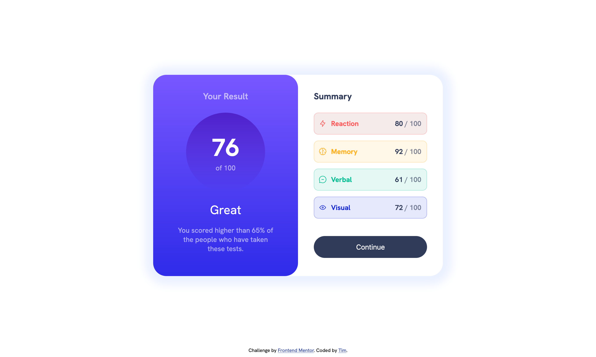
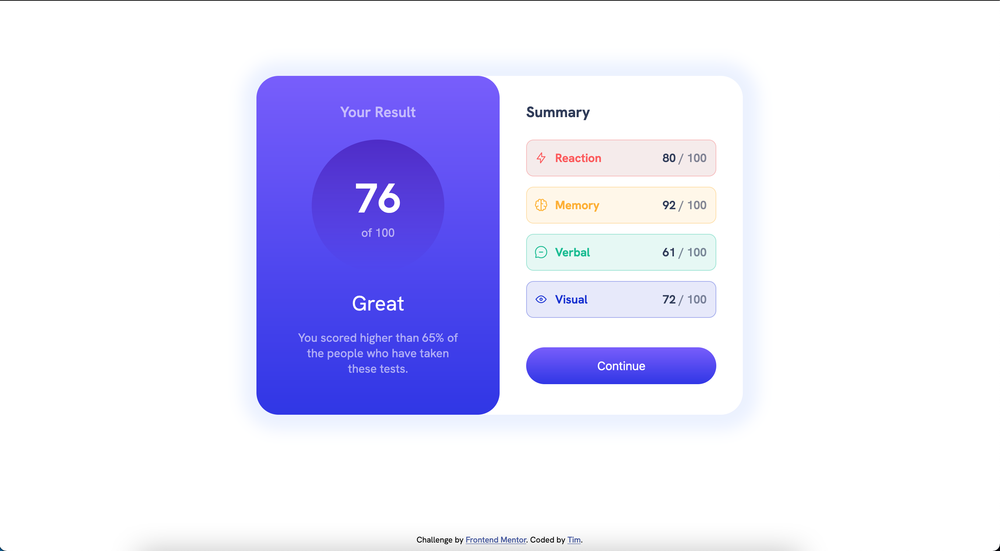
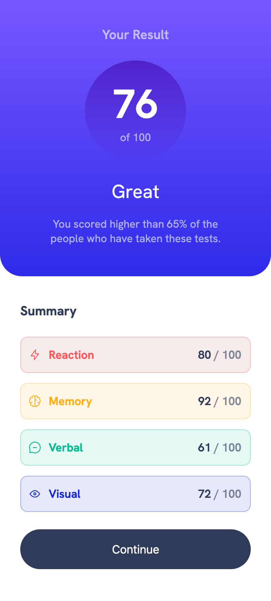

# Frontend Mentor - Results summary component solution

This is a solution to the [Results summary component challenge on Frontend Mentor](https://www.frontendmentor.io/challenges/results-summary-component-CE_K6s0maV). Frontend Mentor challenges help you improve your coding skills by building realistic projects. 

## Table of contents

- [Overview](#overview)
  - [The challenge](#the-challenge)
  - [Screenshot](#screenshot)
  - [Links](#links)
- [My process](#my-process)
  - [Built with](#built-with)
  - [What I learned](#what-i-learned)
  - [Continued development](#continued-development)
  - [Useful resources](#useful-resources)
- [Author](#author)

## Overview

### The challenge

Users should be able to:

- View the optimal layout for the interface depending on their device's screen size
- See hover and focus states for all interactive elements on the page
- **Bonus**: Use the local JSON data to dynamically populate the content

### Screenshot

### Links

- Solution URL: [Add solution URL here](https://your-solution-url.com)
- Live Site URL: [Add live site URL here](https://your-live-site-url.com)

## My process

### Built with

- Semantic HTML5 markup
- CSS custom properties
- Flexbox

### What I learned

- I learned the difference between nth-of-type and nth-child and how they're used. I had issues with nth-child but stepping back and taking the time to learn how to use it helped me understand the problem I was facing.
- I installed fonts for the first time. It was easy to do but 
a helpful thing to learn about.
- This is the first project which I had to create a component through a mobile viewport. So I had to learn the proper css rule to acheive that.

### Continued development

 Although I am developing my flexbox skills, I believe it will become necessary for me to learn how to use CSS grid soon in order to be more efficient in alignment.

### Useful resources

- [Installing fonts on Mac](https://support.apple.com/guide/font-book/install-and-validate-fonts-fntbk1000/10.0/mac/11.0) - This article provides an easy to follow guide on how to install fonts in mac which is also a very easy process to do.
- [nth-of-type vs nth-child](https://css-tricks.com/the-difference-between-nth-child-and-nth-of-type/) - I had trouble using nth-child for this project, but this article helped make it clear when and why to use nth-child and when and why to use nth-of-type.
- [font-face rule](https://www.w3schools.com/css/css3_fonts.asp) - I needed to know how to use the fonts that are in my folder and this article helped me do just that.

## Author

- Frontend Mentor - [@tmy-ide](https://www.frontendmentor.io/profile/yourusername)
